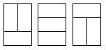

# 问题
在一个3 X N的长方形方格中（N为偶数），铺满1X2的骨牌（骨牌个数不限制），给定N，求方案数（图为N=2的所有方案），所以N=2时方案数为3。



# 思路
设图形的列数为i，那么有以下几种情况


设i列多出来j块，那么可能的情况有

(此处可能有问题，多出来的块是在上面还是下面，其实这是不用考虑的，因为无论在何处下面的推导都是成立的)


所以
````
f(i)(0) = f(i-2)(0) + f(i-1)(1) + f(i-2)(2);
f(i)(1) = f(i-1)(2);
f(i)(2) = f(i)(0) + f(i-1)(1);
````

边界条件
````
f(0)(0) = 1;
f(1)(1) = 1;
f(0)(2) = 1;
````

