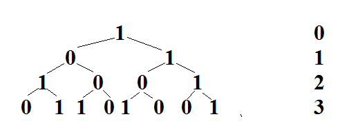

# 问题
对一个“01”串进行一次μ变换被定义为：将其中的"0"变成"10"，"1"变成"01"。初始串为"1"，求经过N(N <= 1000)次μ变换后的串中有多少对"00"。下面是进行3次变换的情况，有2对“00”。



# 思路
可以看出，根为0的左子树及其之后的右子树全部为1，所以其左右两棵子树之间永远不可能出现"00"。

跟为1的左右子树之间每隔一次会出现一对"00"。

我们用 f(0)(i) 和 f(1)(i) 分别表示根为 0 和 1 的树进行 i 次变换后出现"00"的对数。

````
f(0)(i) = f(1)(i-1) + f(0)(i-1);
f(1)(i) = f(0)(i-1) + f(1)(i-1) + (floor(i/2));
````

边界条件为

````
f(0)(1) = 0;
f(1)(1) = 0;
````


