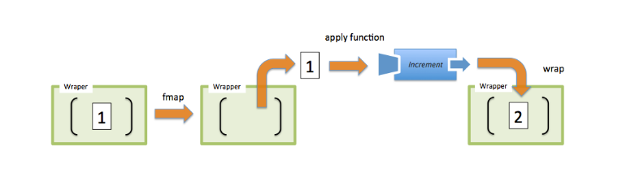

## 基础

### 函数式编程
函数式编程是一种**编程范式**，是一种构建计算机程序结构和元素的风格，它把计算看作是对数学函数的评估，避免了状态的变化和数据的可变。

### 纯函数
对于一个纯函数：
* 给定相同的参数，返回相同的结果（确定性）
* 不会引起副作用

不是纯函数：不确定性的函数，例如，读取外部文件，生成随机数，查询DOM；引起副作用函数，例如修改函数外部数据，打印log，发送http请求。

纯函数的优点：
* 可缓存。因为纯函数有引用透明性，对于相同的输入总有相同的输出，可以把一个函数的调用替换成一个数值。所以可以将函数调用结果缓存下来。
* 可移植。因为不依赖于外部环境。
* 可测试。
* 并行代码。可以并行运行任意纯函数，因为不需要访问共享的内存和数据。

### js中，函数是一等公民
函数是js中的一等公民，这是js支持函数式编程的一个重要原因。

* 函数可以作为常量和变量被引用
* 函数可以作为参数传递给其他函数
* 函数可以作为其他函数的返回结果

### 柯里化
将接受多个参数的函数，变换成接受单一参数的函数，并返回一个函数接受并处理余下的参数。

lodash:curry.

### 偏函数
一个函数，固定其中的几个参数值，从而得到一个新的函数。

使用````Function.prototype.bind````方法可以实现简单的偏函数功能。

lodash:partial.

### 组合
组合是像管道一样，将数据经过不同函数逐渐加工，它是对过程的封装。

利用组合，我们可以避免函数的嵌套。

lodash:flow.

### point free
函数无须提及将要操作的数据是什么样的，函数只是其他函数的复合。

point free 能够帮助我们减少不必要的命名。

### 声明式编程与命令式编程
命令式是通过编写一条一条指令让计算机执行一些动作，这会涉及到很多繁杂的细节。而声明式通过表达式声明我们想干什么，不关心其中的过程。

例如：使用jquery修改dom文字颜色，需要一步一步找到dom，属性赋值；而react只需要直接告诉jsx即可。

再如：
````javascript
//命令式
var CEOs = [];
for(var i = 0; i < companies.length; i++){
    CEOs.push(companies[i].CEO)
}

//声明式
var CEOs = companies.map(c => c.CEO);
````

## 高级

### 范畴学
有以下这些component的collection构成一个范畴
* 对象的collection。
  * 对象就是数据类型，一个数据类型可以看做是所有可能值的集合，这样就可以利用集合论处理类型。
* 态射的collection。
  * 态射是标准的、普通的纯函数。
* 态射的组合。
  * 即 compose。
* Identity 这个独特的态射。
  * 一个原封返回的特殊函数。````const identity=x=>x````。lodash:identity.

### functor
> a functor is nothing more than a data structure you can map functions over with the purpose of lifting values from a container, modifying them, and then putting them back into a container. 

functor 是一个特殊的容器类型，它对数值提供了一层包裹。见[实现代码](./10500functor/110容器.js)



functor 的作用：
* 链式调用。
* Immutable。数据变成了不可变的。
* 将控制权交给 Container。它可以决定如何调用传给 fmap 的函数，可以做 空值判断/异步处理/惰性求值 等工作。

从范畴学来说，functor 是 接受一个范畴的对象和态射，然后把它们映射到另一个范畴里去。

js 中例如 Array.prototype.map, Array.prototype.filter 等都是 functor 


